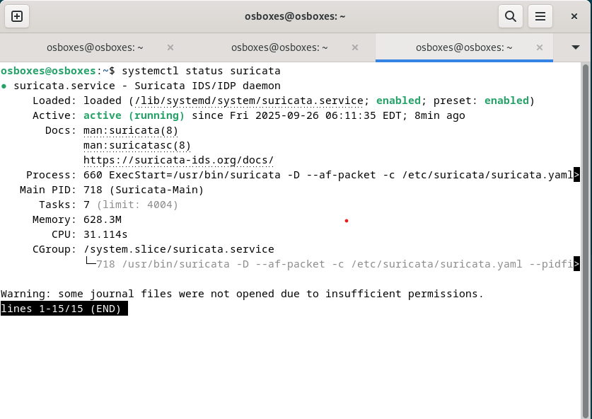
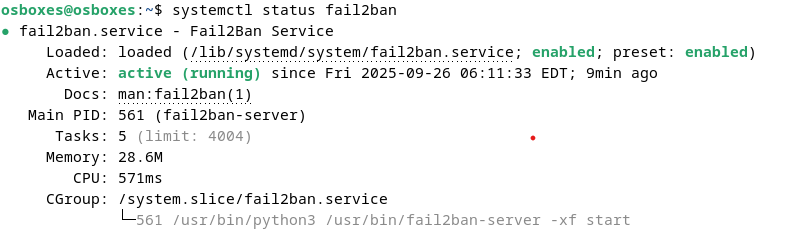
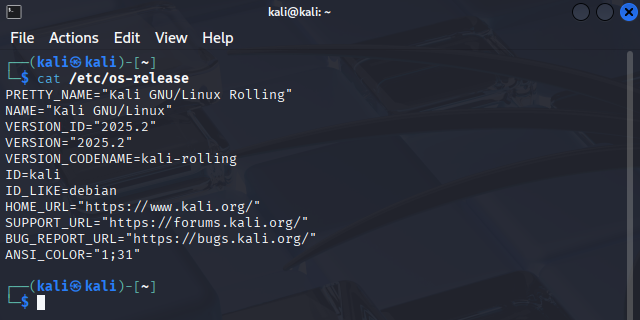

# Домашнее задание к занятию "`Защита сети`" - `Соседова Надежда`

### Задание 1

`Suricata зафиксировала сканирование портов с адреса 10.0.0.5. События ET SCAN указывают на попытки обнаружить службы то, что злоумышленник пытается обнаружить распространенные службы, такие как MySQL, Oracle SQL, MSSQL, PostgreSQL и т.д.
В журнале Fail2Ban события отсутствуют. Fail2ban реагирует на неудачные попытки аутентификации, чтобы заблокировать IP-адрес`

1. `Установлена Suricata.`

2. `Установлен Fail2Ban.`

3. `Развернута ВМ с Kali Linux.`

4. `Запущено сканирование sudo nmap -sA 10.0.0.7`


5. `Запущено сканирование sudo nmap -sT 10.0.0.7`


6. `Запущено сканирование sudo nmap -sS 10.0.0.7`


7. `Запущено сканирование sudo nmap -sV 10.0.0.7`
 


### Задание 2

`Приведите ответ в свободной форме........`

1. `Заполните здесь этапы выполнения, если требуется ....`
2. `Заполните здесь этапы выполнения, если требуется ....`
3. `Заполните здесь этапы выполнения, если требуется ....`
4. `Заполните здесь этапы выполнения, если требуется ....`
5. `Заполните здесь этапы выполнения, если требуется ....`
6. 

```
Поле для вставки кода...
....
....
....
....
```

`При необходимости прикрепитe сюда скриншоты
`


---

### Задание 3

`Приведите ответ в свободной форме........`

1. `Заполните здесь этапы выполнения, если требуется ....`
2. `Заполните здесь этапы выполнения, если требуется ....`
3. `Заполните здесь этапы выполнения, если требуется ....`
4. `Заполните здесь этапы выполнения, если требуется ....`
5. `Заполните здесь этапы выполнения, если требуется ....`
6. 

```
Поле для вставки кода...
....
....
....
....
```

`При необходимости прикрепитe сюда скриншоты
`

### Задание 4

`Приведите ответ в свободной форме........`

1. `Заполните здесь этапы выполнения, если требуется ....`
2. `Заполните здесь этапы выполнения, если требуется ....`
3. `Заполните здесь этапы выполнения, если требуется ....`
4. `Заполните здесь этапы выполнения, если требуется ....`
5. `Заполните здесь этапы выполнения, если требуется ....`
6. 

```
Поле для вставки кода...
....
....
....
....
```

`При необходимости прикрепитe сюда скриншоты
`
